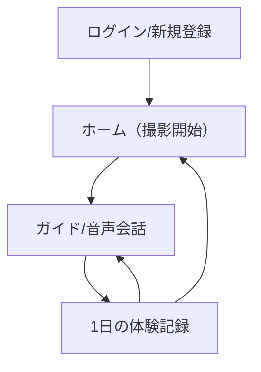

## 1. Product Overview
写真撮影を起点に、現地で音声ガイドを開始し、音声会話と翻訳アシスト（英→日）を使いながら体験できるサービス。
1日の体験を後から振り返れるように、写真・会話ログ等を日次で記録します。

## 2. Core Features

### 2.1 User Roles
| Role | Registration Method | Core Permissions |
|------|---------------------|------------------|
| 一般ユーザー | メール/パスワードで登録・ログイン | 写真撮影、音声ガイド/会話、翻訳アシスト、日次記録の作成/閲覧 |

### 2.2 Feature Module
本サービスの必須ページは以下です。
1. **ホーム（撮影開始）**：写真撮影、権限取得（カメラ/マイク）、ガイド開始導線。
2. **ガイド/音声会話**：ガイド開始、音声会話（話す/聞く）、翻訳アシスト（英→日）切替、セッションログ。
3. **1日の体験記録**：日付別の体験一覧、詳細閲覧、追記（テキスト/写真/ログ添付）。
4. **ログイン/新規登録**：ユーザー認証、ログアウト。

### 2.3 Page Details
| Page Name | Module Name | Feature description |
|-----------|-------------|---------------------|
| ログイン/新規登録 | 認証フォーム | 入力してログイン/登録する（メール、パスワード）。 |
| ログイン/新規登録 | セッション管理 | ログアウトする、未ログイン時は主要ページへ遷移前に誘導する。 |
| ホーム（撮影開始） | 権限チェック | カメラ/マイク権限を確認し、未許可なら許可を促す。 |
| ホーム（撮影開始） | 写真撮影 | 写真を撮影し、プレビューして「ガイド開始」へ進む。 |
| ガイド/音声会話 | ガイド開始 | 撮影した写真を紐づけてガイドセッションを開始する。 |
| ガイド/音声会話 | 音声会話UI | Agoraを使ったリアルタイム音声（聞く/話す）。補助として押して話すUIも提供し、環境に応じて切替できる。 |
| ガイド/音声会話 | 翻訳アシスト（英→日） | モードをON/OFFし、英語入力/英語音声を日本語に提示する。 |
| ガイド/音声会話 | セッション保存 | 会話ログ・関連写真を「本日の体験記録」に保存する。 |
| 1日の体験記録 | 日付別一覧 | 日付ごとに体験記録を一覧表示し、選択して詳細へ遷移する。 |
| 1日の体験記録 | 詳細/追記 | 体験詳細（写真、会話ログ、メモ）を表示し、メモや写真を追記して保存する。 |

## 3. Core Process
- 初回利用フロー：新規登録/ログイン → カメラ/マイク権限許可 → ホームで写真撮影 → ガイド/音声会話で案内開始。
- 現地体験フロー：ガイド/音声会話でやり取り → 必要に応じて翻訳アシスト（英→日）をON → セッションを保存。
- 振り返りフロー：1日の体験記録で日付を選択 → 写真/会話ログ/メモを閲覧 → 追記して保存。

