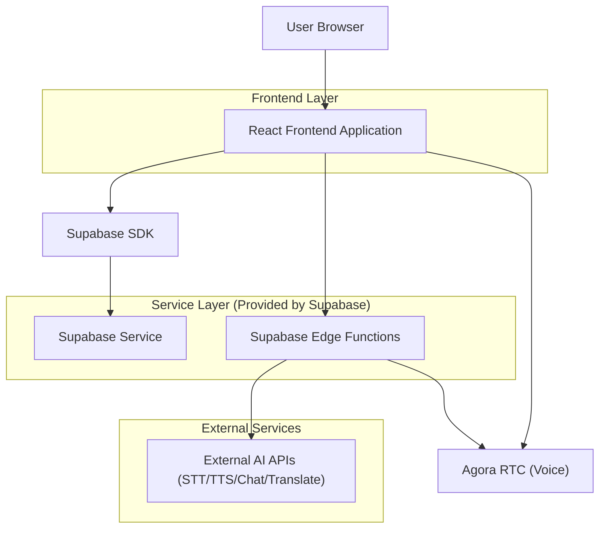
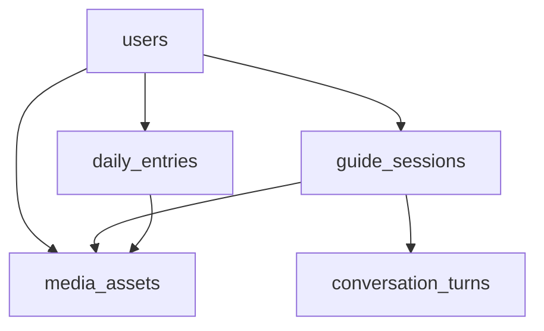

## 1.Architecture design


## 2.Technology Description
- Frontend: React@18 + TypeScript + vite + tailwindcss
- Backend: Supabase（Auth / Database(PostgreSQL) / Storage）+ Supabase Edge Functions（API・外部AI呼び出し）
- Realtime Voice: Agora Web SDK（RTC音声通話）
- Browser APIs: MediaDevices(getUserMedia)（マイク入力）

## 3.Route definitions
| Route | Purpose |
|-------|---------|
| /login | ログイン/新規登録を行う |
| / | ホーム（撮影開始）。権限確認、写真撮影、ガイド開始導線 |
| /guide | ガイド/音声会話。セッション開始、音声入出力、翻訳アシスト切替 |
| /daily | 1日の体験記録。日付別一覧/詳細/追記 |

## 4.API definitions
### 4.1 Core Types（共有TypeScript）
```ts
type GuideSession = {
  id: string;
  userId: string;
  startedAt: string; // ISO
  photoAssetId?: string;
  translationMode: "off" | "en_to_ja";
};

type ConversationTurn = {
  id: string;
  sessionId: string;
  role: "user" | "assistant";
  text: string;
  audioAssetId?: string;
  createdAt: string; // ISO
};

type DailyEntry = {
  id: string;
  userId: string;
  date: string; // YYYY-MM-DD
  title?: string;
  note?: string;
  coverPhotoAssetId?: string;
  createdAt: string;
  updatedAt: string;
};
```

### 4.2 Edge Functions（例）
- POST /functions/v1/agora/token
  - Purpose: Agora RTCのチャネル参加トークンを発行する（フロントにApp Certificateを露出しない）
  - Request: { channel: string, uid: string, role?: "publisher" | "subscriber", ttlSeconds?: number }
  - Response: { appId: string, token: string }

- POST /functions/v1/guide/start
  - Request: { photoAssetId?: string, translationMode: "off" | "en_to_ja" }
  - Response: { session: GuideSession }

- POST /functions/v1/voice/transcribe
  - Request: multipart/form-data（audio）
  - Response: { text: string }

- POST /functions/v1/chat/respond
  - Request: { sessionId: string, userText: string }
  - Response: { assistantText: string }

- POST /functions/v1/voice/tts
  - Request: { text: string, voice?: string }
  - Response: { audioUrl: string }

- POST /functions/v1/translate/en-to-ja
  - Request: { text: string }
  - Response: { translatedText: string }

- POST /functions/v1/daily/append-session
  - Request: { date: string, sessionId: string }
  - Response: { dailyEntryId: string }

※ 外部AI（STT/TTS/会話/翻訳）のAPIキーはEdge Functions側の環境変数で管理し、フロントには露出させない。
※ AgoraのApp Certificateも同様にサーバー側（Edge Functions等）で管理し、フロントには露出させない。

## 6.Data model(if applicable)
### 6.1 Data model definition
関係イメージ（論理キー運用・物理FKは必須としない）。


主要テーブル（例）
- users（Supabase Auth）
- media_assets: { id, user_id, kind(photo|audio), storage_path, created_at }
- guide_sessions: { id, user_id, started_at, photo_asset_id, translation_mode }
- conversation_turns: { id, session_id, role, text, audio_asset_id, created_at }
- daily_entries: { id, user_id, date, title, note, cover_photo_asset_id, created_at, updated_at }
- daily_entry_items: { id, daily_entry_id, type(photo|session|note), ref_id, created_at }

### 6.2 Data Definition Language
```sql
CREATE TABLE media_assets (
  id UUID PRIMARY KEY DEFAULT gen_random_uuid(),
  user_id UUID NOT NULL,
  kind VARCHAR(10) NOT NULL CHECK (kind IN ('photo','audio')),
  storage_path TEXT NOT NULL,
  created_at TIMESTAMPTZ DEFAULT NOW()
);

CREATE TABLE guide_sessions (
  id UUID PRIMARY KEY DEFAULT gen_random_uuid(),
  user_id UUID NOT NULL,
  started_at TIMESTAMPTZ DEFAULT NOW(),
  photo_asset_id UUID,
  translation_mode VARCHAR(10) NOT NULL DEFAULT 'off' CHECK (translation_mode IN ('off','en_to_ja'))
);

CREATE TABLE conversation_turns (
  id UUID PRIMARY KEY DEFAULT gen_random_uuid(),
  session_id UUID NOT NULL,
  role VARCHAR(10) NOT NULL CHECK (role IN ('user','assistant')),
  text TEXT NOT NULL,
  audio_asset_id UUID,
  created_at TIMESTAMPTZ DEFAULT NOW()
);

CREATE TABLE daily_entries (
  id UUID PRIMARY KEY DEFAULT gen_random_uuid(),
  user_id UUID NOT NULL,
  date DATE NOT NULL,
  title TEXT,
  note TEXT,
  cover_photo_asset_id UUID,
  created_at TIMESTAMPTZ DEFAULT NOW(),
  updated_at TIMESTAMPTZ DEFAULT NOW()
);

CREATE TABLE daily_entry_items (
  id UUID PRIMARY KEY DEFAULT gen_random_uuid(),
  daily_entry_id UUID NOT NULL,
  type VARCHAR(10) NOT NULL CHECK (type IN ('photo','session','note')),
  ref_id UUID,
  created_at TIMESTAMPTZ DEFAULT NOW()
);

CREATE UNIQUE INDEX idx_daily_entries_user_date ON daily_entries(user_id, date);
CREATE INDEX idx_conversation_turns_session_created ON conversation_turns(session_id, created_at);

-- grants（基本方針）
GRANT SELECT ON media_assets TO anon;
GRANT ALL PRIVILEGES ON media_assets TO authenticated;
GRANT SELECT ON daily_entries TO anon;
GRANT ALL PRIVILEGES ON daily_entries TO authenticated;
GRANT SELECT ON guide_sessions TO anon;
GRANT ALL PRIVILEGES ON guide_sessions TO authenticated;
GRANT SELECT ON conversation_turns TO anon;
GRANT ALL PRIVILEGES ON conversation_turns TO authenticated;
```
